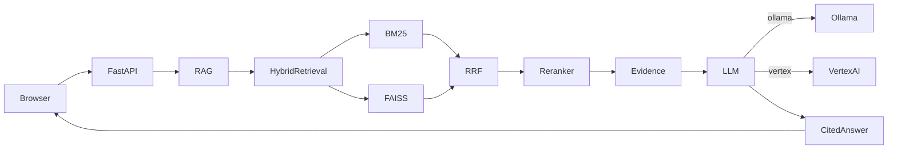

# PPL Enterprise Intelligence — Architecture (V8)

Unified codebase supporting local Ollama and GCP Vertex AI generation with the same v7 ingest and retrieval pipeline.

## Request flow

1. **Browser** sends a question to `POST /api/chat`.
2. **FastAPI** (`app/main.py`) lazily loads the RAG singleton (thread-safe double-checked lock).
3. **Hybrid retrieval** (`app/rag.py`):
   - BGE-M3 semantic search over FAISS (`TOP_K_SEM=40`)
   - BM25 lexical search (`TOP_K_BM25=40`)
   - Reciprocal Rank Fusion (`RRF_K=60`) merges candidates
   - BGE reranker-v2-m3 re-scores top `RERANK_CANDIDATES=36`, keeps `TOP_K_FINAL=10`
4. **Evidence assembly** builds context blocks with document metadata, table/field labels, and **layout confidence** tags (v7 ingest).
5. **LLM generation** via `llm_generate()` dispatcher:
   - `LLM_BACKEND=ollama` → local Ollama `/api/chat` (Qwen 2.5 7B default)
   - `LLM_BACKEND=vertex` → Vertex AI Gemini via `google-genai`
6. **Cited answer** returned with `[E1]…` evidence list; UI renders PDF page on citation click.

## Ingest pipeline (v7)

`app/ingest.py` produces schema v7 index under `data/index/`:

- Manifest-driven document metadata (type, fiscal year, reporting period)
- Layout-aware table extraction with per-cell **layout_confidence** (`high` / `medium` / `low` / `none`)
- Chunking for narrative text; table rows as separate evidence units
- Outputs: `records.json`, `semantic.faiss`, `bm25.pkl`, `meta.json`

The RAG `answer()` method applies **confidence hedging**: low/none confidence evidence must not be quoted as exact figures; medium gets a caveat.

## Deployment profiles

| Profile | `DEPLOYMENT_PROFILE` | LLM backend | Notes |
|---------|---------------------|-------------|-------|
| **Local** | `standard` (default) | `ollama` | Full self-hosted; CUDA optional for embeddings |
| **GCP trial** | `gcp-trial` | `vertex` | Cloud Run + Vertex AI; CPU embeddings/reranker |
| **Corporate** | `corporate` | `ollama` or `vertex` | Rejects external-only backends (e.g. groq); in-boundary only |

Profile validation runs at import time in `app/config.py`.

## Key configuration

| Component | Local default | GCP default |
|-----------|---------------|-------------|
| `LLM_BACKEND` | `ollama` | `vertex` (auto when `VERTEX_PROJECT_ID` set) |
| `DEVICE` | `cuda` if available, else `cpu` | `cpu` |
| `EMBED_MODEL` | `models/bge-m3` | same (baked in Docker image) |
| `RERANKER_MODEL` | `models/bge-reranker-v2-m3` | same |
| Generation | Ollama Qwen 2.5 7B | Gemini 2.5 Flash |

## API surface

| Endpoint | Purpose |
|----------|---------|
| `GET /api/health` | Index status + backend-specific LLM readiness |
| `GET /api/system` | Full system info (models, index stats, documents) |
| `GET /api/documents` | PDF list with page counts |
| `GET /api/pdf/page/{page}` | Rendered page image for viewer |
| `POST /api/chat` | Grounded Q&A with evidence citations |

## Health checks

`/api/health` returns:

- Always: `ok`, `index`, `llm_backend`, `documents`
- When `ollama`: `ollama` (reachable), `ollama_model`
- When `vertex`: `vertex_project_configured`, `vertex_model`

The UI status dot reflects the active backend, not a hardcoded Ollama check.

## Docker / Cloud Run

The `Dockerfile` downloads models and runs ingest at build time so the deployed image is self-contained. Cloud Run uses Application Default Credentials for Vertex — no API key required.

See [README-GCP.md](README-GCP.md) for deploy commands and pre-flight checklist.
